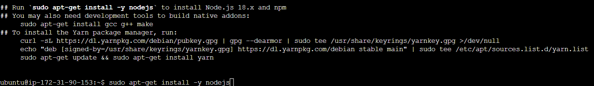
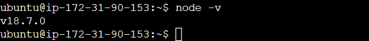
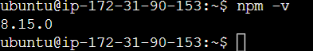
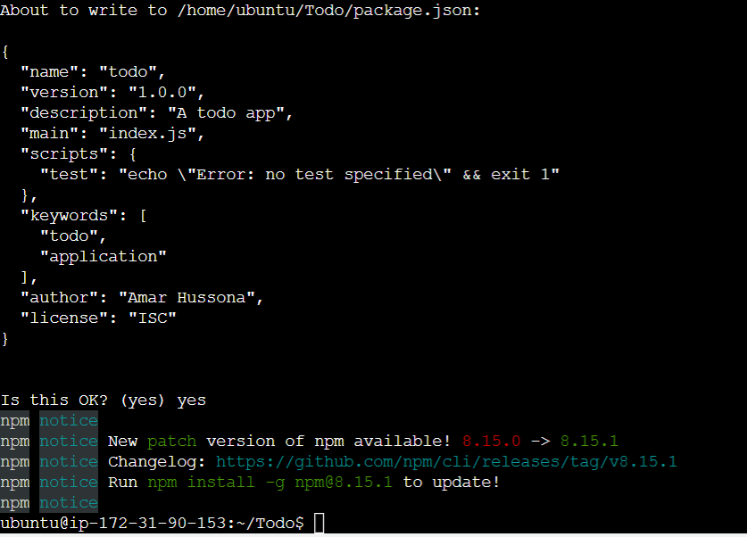

# Documentation for Project 3 (MERN)

## BACKEND CONFIGURATION

`sudo apt update`

`sudo apt upgrade`

`curl -fsSL https://deb.nodesource.com/setup_18.x | sudo -E bash -`

`sudo apt-get install -y nodejs`

Node version:

Npm version:

`mkdir Todo`

`cd Todo`

`npm init`

