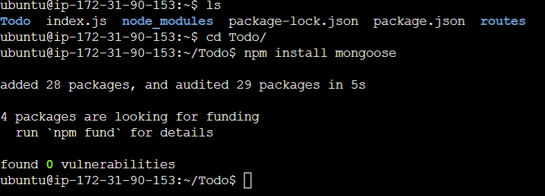

# Documentation for Project 3 (MERN)

## BACKEND CONFIGURATION

`sudo apt update`

`sudo apt upgrade`

`curl -fsSL https://deb.nodesource.com/setup_18.x | sudo -E bash -`

`sudo apt-get install -y nodejs`

Node version:

Npm version:

`mkdir Todo`

`cd Todo`

`npm init`

## INSTALL EXPRESSJS

`npm install express`

`touch index.js`

`npm install dotenv`

`nano index.js`

`node index.js`

Add new inbound rule:

`mkdir routes`

`cd routes`

`touch api.js`

`nano api.js`

## MODELS

Change directory into Todo folder.

`npm install mongoose`

`mkdir models`

`cd models`

`touch todo.js`

`nano todo.js`

Update api.js in routes folder to use new model:

`nano api.js`

## MONGODB DATABASE

Set up an account with mLab and allow access to the new MongoDB from anywhere.

`touch .env`

`nano .env`

Add the connection string to access the database in it, just as below:

Update index.js with this code:

<!-- const express = require('express');
const bodyParser = require('body-parser');
const mongoose = require('mongoose');
const routes = require('./routes/api');
const path = require('path');
require('dotenv').config();

const app = express();

const port = process.env.PORT || 5000;

//connect to the database
mongoose.connect(process.env.DB, { useNewUrlParser: true, useUnifiedTopology: true })
.then(() => console.log(`Database connected successfully`))
.catch(err => console.log(err));

//since mongoose promise is depreciated, we overide it with node's promise
mongoose.Promise = global.Promise;

app.use((req, res, next) => {
res.header("Access-Control-Allow-Origin", "\*");
res.header("Access-Control-Allow-Headers", "Origin, X-Requested-With, Content-Type, Accept");
next();
});

app.use(bodyParser.json());

app.use('/api', routes);

app.use((err, req, res, next) => {
console.log(err);
next();
});

app.listen(port, () => {
console.log(`Server running on port ${port}`)
});` -->

`node index.js` to start server

Got this error:

Reason for this is due to .env being placed in the Todo dir instead of ~ dir.

Install Postman to test API endpoints

POST request:

GET request:

DELETE request:

<!-- I passed the id into the url to get the DELETE request. Please let me know if this is the correct/optimal way to do so. -->

